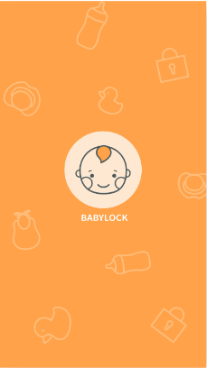
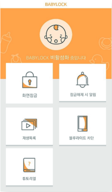
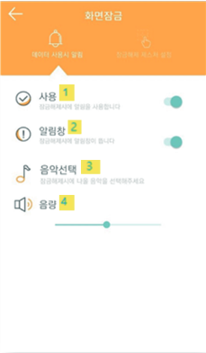
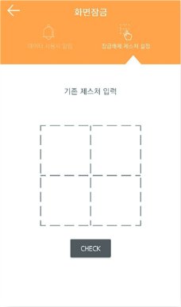
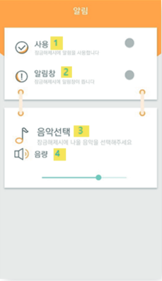
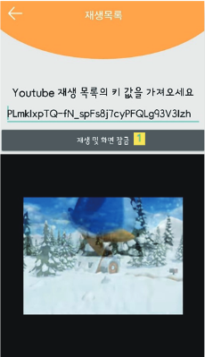
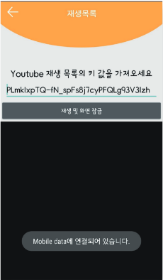
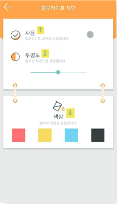

# Baby Lock

## 스플래시 화면

Baby Lock을 실행하면 2초 동안 뜨는 스플래시 화면입니다.

## 메인 화면

재생 목록, 블루라이트 차단, 튜토리얼 등의 메뉴로 이동 할 수 있습니다.

## 데이터 사용 시 알림창

1. 기능을 사용할지 설정합니다.
2. 알림창을 사용할지 설정합니다.
3. 데이터로 접속 시에 나올 음악을 선택합니다.
4. 음악의 크기를 조절합니다.

## 잠금 해제 제스처 설정

기존 제스처를 입력하고 새로운 잠금 해제 제스처로 바꿀 수 있습니다.

## 잠금 해제 시 알림

1. 기능을 사용할지 설정합니다.
2. 알림창을 사용할지 설정합니다.
3. 잠금 해제 시에 나올 음악을 선택합니다.
4. 음악의 크기를 조절합니다.

## 재생목록 설정

1. 버튼을 누르면 영상을 재생하고 화면을 잠금합니다.
2. Baby Lock이 실행되었다고 Notification 알림을 띄우고 그 알림을 누르면 화면 잠금을 푸는 제스처를 누르는 화면이 뜨게됩니다.
3. 이 화면에 들어올 때 모바일 데이터에 연결되어 있으면 Notification 알림이 뜨게됩니다. Wi-Fi 연결 중 및 아무것도 연결 안 되어 있을 때는 Toast 메시지만 띄웁니다.

## 모바일 데이터 연결 메시지

이와 같이 데이터에 연결되어 있으면 Toast 메시지가 뜨게 됩니다. 또한 Notification 알림으로 '※주의※ 모바일 데이터에 연결되어 있습니다.' 라는 알림이 뜨면서 영상 재생 시 데이터에 연결되어 있다는 것을 한번 더 알려줍니다.

## 블루라이트 차단

1. 기능을 사용할지 설정합니다.
2. 필터의 투명도를 설정합니다.
3. 필터의 색상을 설정합니다.
