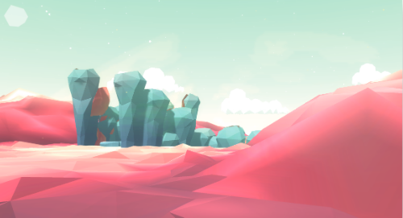
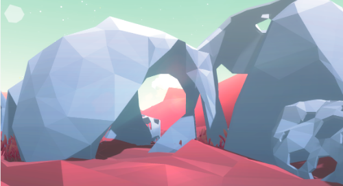
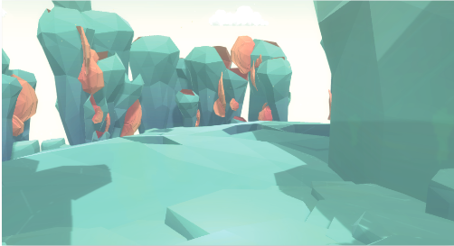
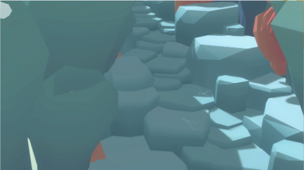
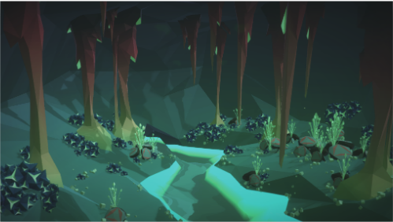
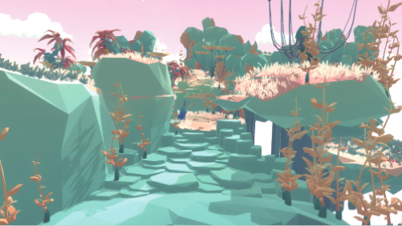
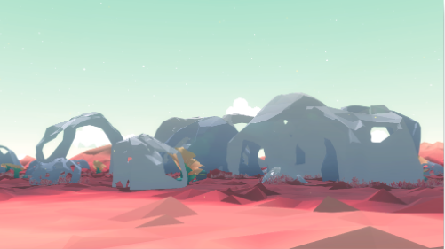

# Project Urban

## 인게임 화면

### 인게임 화면 - 1

주변에서 찾을 수 있는 바위와 비슷한 오브젝트를 모델링 한 후 모아서 위와 같이 돌계단을 제작했다.

이러한 디자인의 돌계단은 공원과 비슷한 장소에서 쉽게 찾을 수 있다. 개인적으로 마음에 든 부분이었기에 작품에 넣었다.

### 인게임 화면 - 2

지형의 그라데이션 부분이 적용된 부분이다. 밝은 색에서 어두운색으로 그라데이션 되고 있다.

### 인게임 화면 - 3

이 프로그램에 사용된 모든 오브젝트는 3D MAX로 모델링 되었다.
위 사진은 이러한 모델들 중 하나이며 개인적으로 가장 마음에 드는 형식의 디자인 모델이다.

### 인게임 화면 - 4

추상적 구조물과 단순 디자인 구조물에 결합하였다.

### 인게임 화면 - 5

이번에 제작하게 된 디자인 프로그램의 첫 번째 신이다.
첫 번째 신은 다른 신들과는 달리 복잡한 구조를 모티브로 디자인하였기에 비교적 꽉 차 보이는 디자인을 볼 수가 있다.

### 인게임 화면 - 6

두 번째 신은 폐쇄된 공간을 빗대어 제작하였다. 기둥은 동굴의 바위에서 영감을 얻었다.

### 인게임 화면 - 7

돌계단 모델을 적극적으로 활용한 신이다.
넓고 평평한 바위 모델을 여러 사이즈로 조정하여 배치해 돌계단과 유사한 디자인을 만들었다.

### 인게임 화면 - 8

단순한 배경에 추상적인 물체들을 배치해 놓은 신이다.
