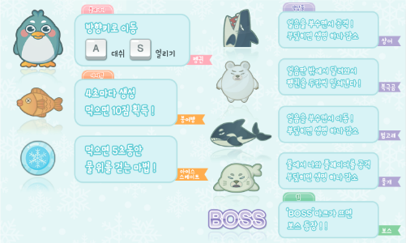
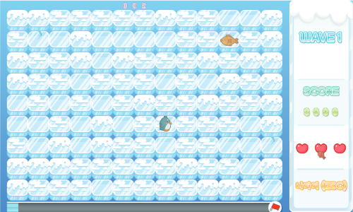
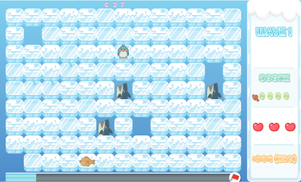
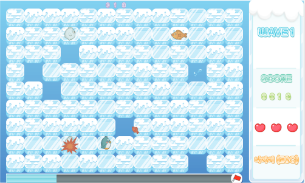
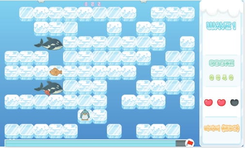
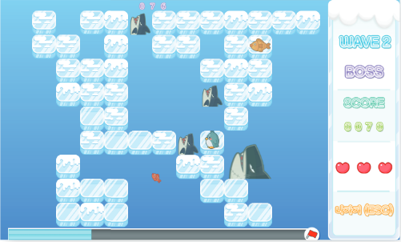
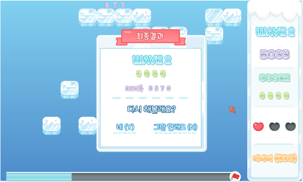

# 구해줘! 펭귄

## 메인 화면

게임의 메인화면은 게임의 스토리인 북극의 느낌이 나도록 제작되었고, 게임시작, 게임설명, 게임종료 3가지 기능이 있다.

## 설명 창

게임 설명 창에는 게임의 등장하는 주인공, 악당, 아이템의 설명과 조작 방법이 적혀있다.

## 인게임 화면

### 인게임 화면 - 1

게임 화면은 필드와 우측에 스테이지, 점수, 생명력, 나가기 버튼, 하단에 게이지로 구성되어 있다.

### 인게임 화면 - 2

먼저 게임의 주된 악당인 상어는 얼음판 아래에서 생성되며, 생성되기 전에 얼음을 부수며 플레이어에게 암시해준다.

### 인게임 화면 - 3

북극곰은 플레이어와 충돌 시 생멱력을 잃게 하진 않지만, 플레이어를 밀어 냄으로써 게임 플레이 방식의 폭을 넓혀준다.

### 인게임 화면 - 4

범고래는 맵 끝에서 생성되며 한 라인을 빠르게 지움으로 플레이어의 플레이에 제약을 놓는 역할을 한다.

### 인게임 화면 - 5

게임의 보스 스테이지에 들어가면, 우측 스테이지 하단에 BOSS를 표기하며 플레이어에게 알려주며 등장한다.

## 게임 엔딩 화면

게임이 종료될 경우 자신이 도달한 스테이지 점수, 게임 플레이여부를 묻는 내용이 포함된 창이 띄워지게 된다.
