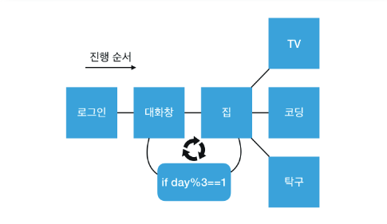
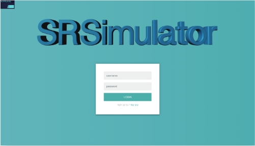
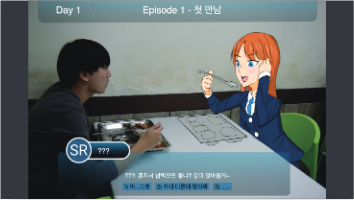
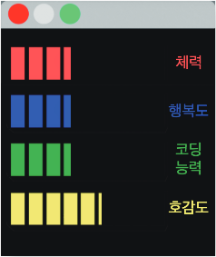
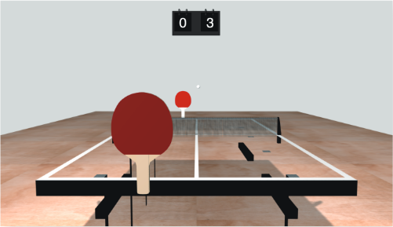
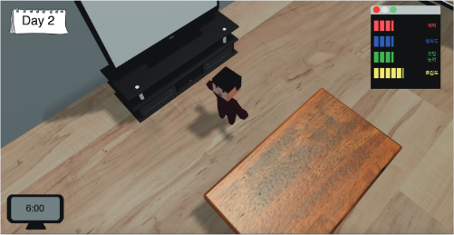

# SRSimulator

## 스토리보드

## 로그인 화면

위 페이지에서는 게임의 제목이 마우스의 움직임에 따라 보는 각도가 달라진다. 이를 통해서 게임이 시작하기 전에 잠깐 3D를 체험할 수 있다.

## 게임 대화창

웹상에서 즐길 수 있는 미소녀 연애 시뮬레이션 형식의 게임이다. 로그인 후 바로 게임이 시작되며, Day 1부터 시작 하게 된다. 대화창 게임은 Day가 1, 4, 7, 10일 때 대화창 게임이 시작되고 순서대로 에피소드 1부터 4까지 플레이하게 된다. 에피소드 1의 제목은 첫 만남, 2는 일상에서의 만남, 3은 의도치 않은 데이트, 4는 고백이다. 자신의 선택에 따라 호감도가 상승하고 하락한다. 호감도가 완전히 떨어지면 결국 모솔 탈출 실패로 삼훈이는 죽게 된다.

## 시간 설명

왼쪽은 day, 오른쪽은 시간이다. 시간은 1분이 지날 때마다 1시간씩 증가한다. 12시간이 되면 day가 증가하고 시간은 다시 0으로 돌아간다. 위에서도 말했듯이 day가 1, 4, 7, 10일 때 집을 떠나고 대화창 게임으로 넘어간다. day가 넘어갈 때마다 캐릭터의 자는 모습과 함께 침대 옆으로 스폰된다.

## 스탯창

스탯은 체력, 행복도, 코딩능력, 호감도로 총 네가지가 있다. 체력은 탁구를 플레이하고 승패에 따라 증가하거나 감소한다. 행복도는 TV를 보면 증가한다. 코딩 능력은 코딩 게임을 하면 되는데, 주어진 코딩 관련 텍스트를 몇초 안에 따라 치는지에 따라 코딩 능력이 증가하거나 감소한다. 호감도는 대화창 게임에서 어떤 선택지를 선택하느냐에 따라 증가하거나 감소한다. 만약 플레이 도중에 선택지를 잘못 선택해서 호감도가 바닥날시 바로 호감도와 관련된 베드엔딩으로 이동한다. 능력치마다 수치가 바닥날시 해당 능력치와 관련된 배드엔딩으로 직결된다. 동시다발적으로 각각의 능력치가 떨어지면 우선되는 능력치에 따라 엔딩이 결정된다. day가 증가할 때마다 모든 능력치가 감소하기에 날마다 각 스텟을 철저히 관리해야한다.

## 코딩 게임

코딩 게임은 C, Java, Javascript, Python으로 분류된다. 언어 하나를 선택한 후 3초 카운트다운이 시작된다. 카운트다운이 끝나면 선택한 언어의 코드와 관련된 텍스트가 출력된다. 플레이 방식은 출력된 코드를 그대로 따라 치면 된다. 언어마다 따라쳐야 할 코드는 총 10줄이며, 잘못 따라 쳤을 시 그 텍스트를 다시 입력하게 된다. 주어진 코드를 얼마나 빨리 치느냐에 따라 코딩 능력이 증가하거나 감소한다. 시간은 3시간이 흐른다.

## 탁구 게임

마우스 포인트를 y축 위로 올릴수록 핸들이 앞으로 이동하고 아래로 내리면 뒤로 이동한다. 공의 근처에 가까이 놓기만 해도 핸들의 위치가 공의 위치로 이동하면서 칠 수 있다. 상대 핸들은 공의 x축 위치에 따라 움직인다. 승패는 어느 쪽이 7점에 먼저 도달하는지에 따라 결정된다. 자신과 상대의 점수 차이에 따라 체력이 증가하거나 감소한다. 플레이를 하고 난 후 4시간이 흐른다.

## TV 시청

위 사진에 보이는 TV를 선택하고 근처에 갔을 때 실제로 TV를 보고 있는 개발자의 모습이 나타난다.

TV를 보고나면 행복도가 올라간다. 해당 컨텐츠를 진행하고 난 후 2시간이 흐른다.
