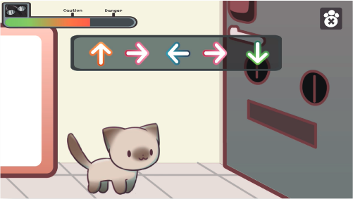

# 고양이 탈출기 ~산넘어 산~

서울의 한 집에 회사원 '영희'씨는 밤샘 야근에 찌든 상태로 집으로 돌아온다.

돌아와 고양이 '산이'가 자신을 반기지만 밤샘 작업으로 힘든 영희는 산이를 무시하고 침대로 쓰러진다.

쓰러진 영희를 보며 고양이 산이는 꿈 꿔오던 탈출을 결심한다.

인트로 이후 게임처럼 영상이 시작한다.

안방에서 탈출을 결심하게 된 산이는 문을 향해 걸어간다.

가는 길에 옛 친구 '나비'를 만나게 되고 나비로부터 참치캔을 받아 탈출을 시작한다.

안방에서 나온 신이는 현관을 향해 걸어가지만 자신도 모르게 TV 리모컨을 밟아 TV에서 '스페이스 캣'이 틀어져버렸다. 자신의 집사 영희가 깼나 싶었지만 아직 일어나지 않은 듯하자 다시 탈출을 강행한다.

자신의 탈출을 매번 방해하는 머그컵을 만나 전투를 한다. 산이는 머그컵을 가볍게 해치우고선 앞으로 향한다.

최종 보스인 '강철문'을 만나 대적하게 된다.

리듬게임처럼 커맨드를 입력하여 싸운다.

열심히 대적하던 산이는 너무 흥분한 나머지 잠들어 있던 영희씨의 잠을 깨우고 만다.

영희씨에게 안겨 돌아가는 산이의 모습을 마지막으로 영상은 끝이 난다.
